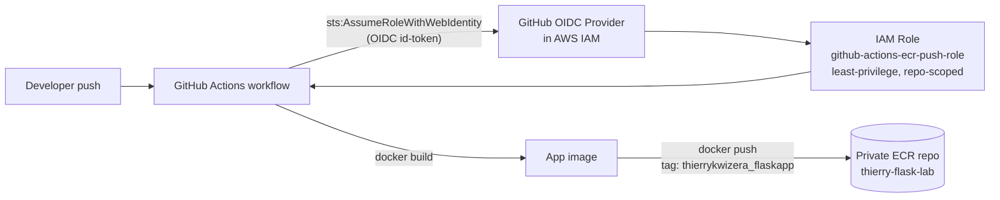

# Push Docker Image to ECR

Containerized Flask app, built and pushed to a private Amazon ECR repository by
GitHub Actions, authenticating to AWS via GitHub OIDC (no long-lived AWS keys).

## Architecture

## Repository layout

| Path | Purpose |
|---|---|
| [app.py](app.py) | Flask application (`/` and `/health` routes) |
| [Dockerfile](Dockerfile) | Multi-step, non-root, minimal-base image build with a container `HEALTHCHECK` |
| [.dockerignore](.dockerignore) | Keeps build context small and secrets/VCS metadata out of the image |
| [requirements.txt](requirements.txt) | Python dependencies |
| [infra/ecr-repo.yaml](infra/ecr-repo.yaml) | CloudFormation: private ECR repo (scanning + lifecycle policy), GitHub OIDC provider (optional), least-privilege IAM role |
| [.github/workflows/build-and-push.yml](.github/workflows/build-and-push.yml) | CI/CD: OIDC auth → build → tag → push to ECR on every push |

## AWS setup (Management Console — done by the repo owner, not automated here)

1. **Check whether the GitHub OIDC provider already exists**, so you know which
   value to use in step 2:
   - Go to **IAM → Identity providers**.
   - If a provider with URL `token.actions.githubusercontent.com` is already
     listed, it exists — you'll set `CreateOIDCProvider` to `false`.
   - If the list is empty (no such provider), you'll set it to `true`. An AWS
     account can only have **one** provider per URL, so never create a second one.

2. **Deploy the CloudFormation stack** (creates the ECR repo + IAM role):
   - Go to **CloudFormation → Stacks → Create stack → With new resources (standard)**.
   - Under **Prepare template**, choose **Template is ready**.
   - Under **Specify template**, choose **Upload a template file**, and upload
     [infra/ecr-repo.yaml](infra/ecr-repo.yaml) from this repo.
   - Click **Next**. For **Stack name**, enter `push-docker-image-to-ecr-lab`.
   - On the **Parameters** step, set:
     | Parameter | Value |
     |---|---|
     | `RepositoryName` | `thierry-flask-lab` (or leave default) |
     | `GitHubOrg` | `thierry0011` |
     | `GitHubRepo` | `md4-Push-Docker-Image-to-ECR` |
     | `GitHubBranch` | `*` (leave default — matches the workflow triggering on every branch) |
     | `RoleName` | `github-actions-ecr-push-role` (or leave default) |
     | `CreateOIDCProvider` | `false` if the provider already existed in step 1, otherwise `true` |
   - Click **Next** through the **Configure stack options** page (defaults are fine).
   - On the **Review** page, scroll to the bottom and check the box
     **"I acknowledge that AWS CloudFormation might create IAM resources with custom names"**
     (required because the template creates a named IAM role).
   - Click **Submit** and wait for the stack status to reach `CREATE_COMPLETE`.

3. **Read the outputs** — on the stack's page, open the **Outputs** tab and note:
   - `RepositoryUri` — the ECR repository URI.
   - `GitHubActionsRoleArn` — the role ARN GitHub Actions will assume.

4. **Confirm the workflow matches those outputs** — open
   [.github/workflows/build-and-push.yml](.github/workflows/build-and-push.yml)
   and check that `AWS_ROLE_ARN`, `ECR_REPOSITORY`, and `AWS_REGION` match the
   `GitHubActionsRoleArn` output, the repository name, and the region you
   deployed the stack in (defaults assume `us-east-1`). Edit and push a fix if
   any of them differ from what the console shows.

5. **Verify the ECR repository in the console** — go to **ECR → Repositories**
   and confirm `thierry-flask-lab` exists, is **Private**, and has **Scan on
   push** enabled (visible on the repository's detail page).

6. Push to any branch — the workflow builds the image, tags it
   `thierrykwizera_flaskapp` (plus the commit SHA), and pushes both tags to the
   private ECR repo. No AWS access keys are stored in GitHub at any point. You
   can watch the pushed image appear under **ECR → Repositories →
   thierry-flask-lab → Images** in the console, and check the run status under
   the repo's **Actions** tab on GitHub.

## Deliverables

- GitHub repository: https://github.com/thierry0011/md4-Push-Docker-Image-to-ECR
- Private ECR repository: `thierry-flask-lab` (URI from the stack's `RepositoryUri` output — add the console link here once deployed)
